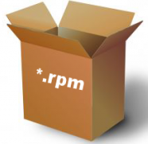

## Paquetes RPM
# ¿Qué son los paquetes rpm?
Es un sistema de gestión de paquetes que se ejecuta en Red Hat Enterprise Linux, CentOS y Fedora. Puede utilizar RPM para distribuir, gestionar y actualizar el software que cree para cualquiera de los sistemas operativos mencionados anteriormente.

El uso de gestor de paquetes para el administrador de sistemas que realice mantenimiento y actualización de software trae ventajas como simplicidad, consistencia y la capacidad de que aquellos procesos se automaticen.

Entre las características de RPM están:

- Los paquetes pueden ser cifrados y verificados con GPG y MD5.
- Los archivos de código fuente (por ejemplo .tar.gz, .tar.bz2) están incluidos en SRPMs, posibilitando una verificación posterior.
- PatchRPMs y DeltaRPMs, que son equivalentes a ficheros parche, pueden actualizar incrementalmente los paquetes RPM instalados.
- Las dependencias pueden ser resueltas automáticamente por el gestor de paquetes.

