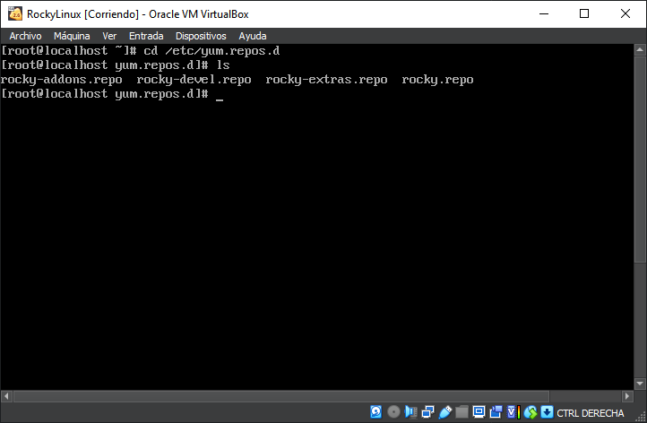
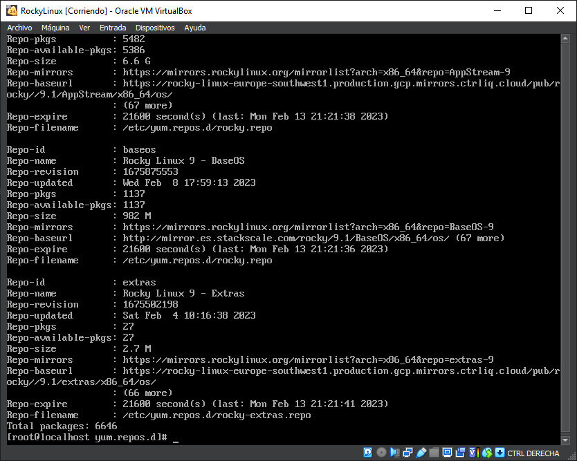
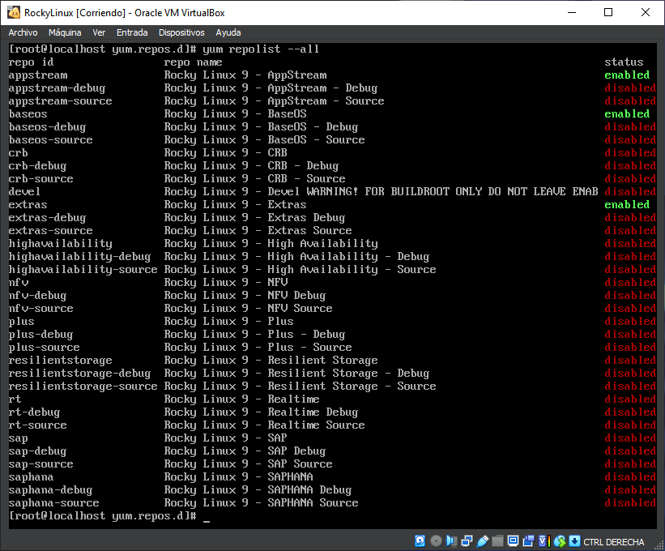
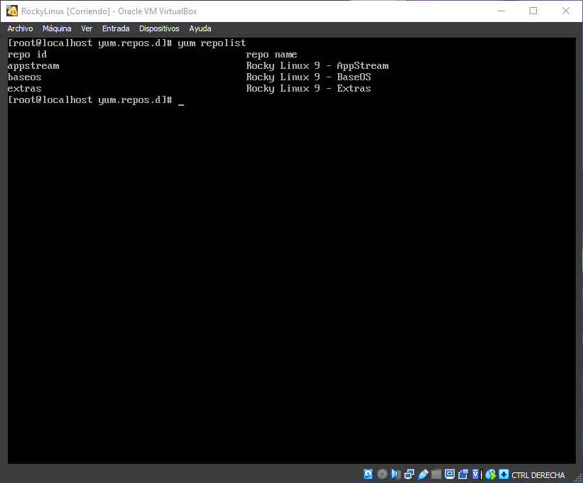

## Repositorios Rocky Linux
# ¿Dónde se encuentra los repositorios?
Los repositorios se encuentran en "/etc/yum.repos.d/", a ellos podremos acceder a través del comando "cd /etc/yum.repos.d/.

Para mostrar el contenido hay que poner el comando "ls"

Con los siguientes comandos, podremos observar las características principales

- "yum repoinfo"

Muestra la información sobre los repositorios instalados. Donde podremos observar que la ruta donde los repositorios se guardan es en "/etc/yum.repos.d/rocky.repo" en el apartado que dice "Repo-filename"

- "yum repolist --all"

Muestra los repositorios que esten tanto habilitados como deshabilitados.

- "yum repolist"

Muestra los repositorios que estén habilitados del sistema.

